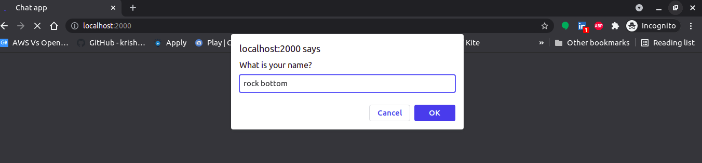
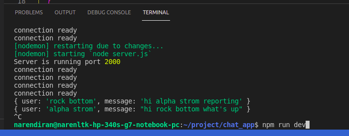
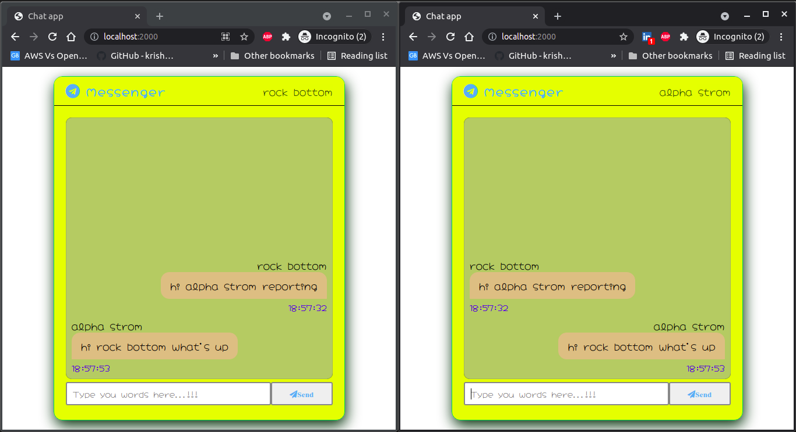

# socket io chat application
Chat app using the Node JS, Socket IO and Express

Here you can get the code for creating your own chat app.

If your directly going to clone this git repo then you may follow the steps given below and do it. 

## Step 1:

Open your terminal and git clone with the following command

```
git clone https://github.com/narenltk/socket_io_chat_app.git
```

## Step 2:

Since I have given all the dependencies in the package.json all you need to do is give the following command

```
npm install
```
This command actually installs all the dependencies given in the package.json file.


## verify in your loaclsystem with the port 

```
http://localhost:2000
```

```
npm run dev
```
## Enter you name

<p align="center">
  
</p>

## console log details
<p align="center">
  
</p>

## Output

<p align="center">
  
</p>
